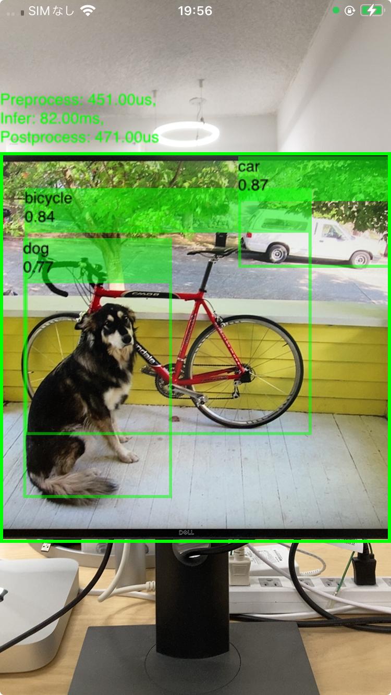

# wonnx-ios

This repository contains a simple iOS application that uses the WONNX crate to run a yolox model on iOS.




## How to run
1. Build the WONNX interpreter for iOS
```bash
./build.sh
```

2. Open the `WONNX-iOS.xcodeproj` file in Xcode and run the project on a device or simulator.

3. Install the app to your device


